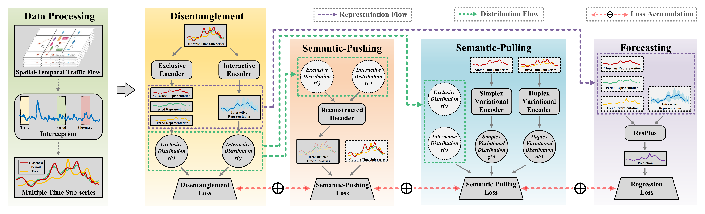

# MUSE-Net: Disentangling Disentangling Multi-Periodicity for Traffic Flow Forecasting (MUSE-Net) 
#### *by: Jianyang Qin, Yan Jia, Yongxin Tong, Heyan Chai, Ye Ding, Xuan Wang, Bingxin Fang and Qing Liao*


## Abstract
<p align="center">

</p>

Accurate forecasting of traffic flow plays a crucial role in building smart cities in the new era. Previous works have achieved success in learning inherent spatial and temporal patterns of traffic flow. However, existing works investigated the multiple periodicities (e.g. hourly, daily, and weekly) of traffic flow via entanglement learning which leads to inaccurate prediction of traffic flow. The entanglement learning that learns a unified representation for multiple periodicities has not yet dealt with the distribution shift and dynamic temporal interaction problems in traffic flow forecasting. In this paper, we propose a novel disentanglement learning framework, called <b>MU</b>lti-Pattern Di<b>SE</b>ntanglement Network (<b>MUSE-Net</b>), to tackle the limitations of entanglement learning by simultaneously factorizing the exclusiveness and interaction of multi-periodic patterns in traffic flow. Grounded in the theory of mutual information, we first learn and disentangle exclusive and interactive representations of traffic flow from multi-periodic patterns. Then, we utilize semantic-pushing and semantic-pulling regularizations to encourage the learned representations to be independent and informative. Moreover, we derive a lower bound estimator to tractably optimize the disentanglement problem with multiple variables and propose a joint training model for traffic flow forecasting. Extensive experimental results on several real-world traffic datasets demonstrate the effectiveness of the proposed framework.


## Requirements:
- Python 3.6
- tensorflow-gpu ==1.3.0
- keras == 2.0.8
- Numpy
- Pandas
- h5py == 2.9.0

## Datasets
You can download the preprocessed datasets from [BaiduYun](https://pan.baidu.com/s/1WFhTG5KqIzJ-UzB3SmNKOQ?pwd=hm21).

We used three public datasets in this study:
- NYC-Bike
- NYC-Taxi
- TaxiBJ

## Train:
You can train our MUSE-Net by following the steps bellow.

 - Download the datasets and put them in "Data" folder

 - Run with "python train.py" for NYC-Bike dataset, or "python train.py --dataset BikeNYC --device 0" for NYC-Bike dataset using GPU device 0

   ```
   python train.py
   ```

   ```
   python train.py --dataset BikeNYC --device 0
   ```

 - Check the output results (RMSE and MAE). Models are saved to "Exps" folder for further use.

## Test:
To obtain the best results reported in our paper, you can test our MUSE-Net via pre-trained models which can be downloaded from [BaiduYun](https://pan.baidu.com/s/1tu-8UT9NBoCpGQ0Nn2xi7g?pwd=9qwy).

 - Download the pre-trained models and put them in 'Exps' folder

 - Run with "python test.py" for NYC-Bike dataset, or "python test.py --dataset BikeNYC --device 0" for NYC-Bike dataset using GPU device 0

   ```
   python test.py
   ```

   ```
   python test.py --dataset BikeNYC --device 0
   ```

 - Check the output results (RMSE and MAE).
