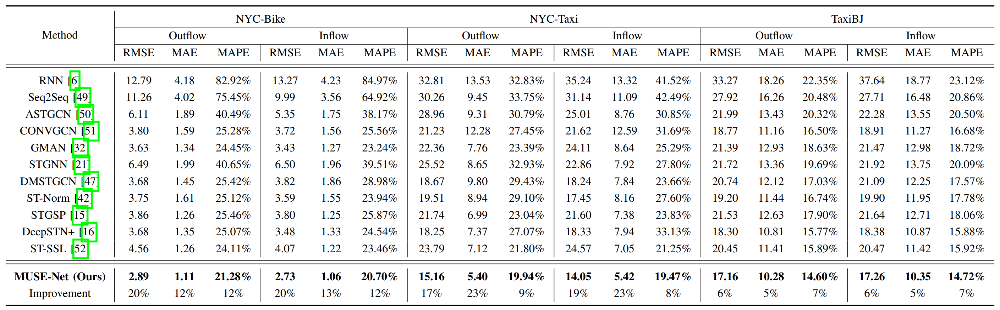

# MUSE-Net: Disentangling Disentangling Multi-Periodicity for Traffic Flow Forecasting (MUSE-Net) 
#### *by: Jianyang Qin, Yan Jia, Yongxin Tong, Heyan Chai, Ye Ding, Xuan Wang, Bingxin Fang and Qing Liao*

## Models

This project includes the source code of MUSE-Net and comparative baselines.

## Datasets
You can download the preprocessed datasets from [BaiduYun](https://pan.baidu.com/s/1WFhTG5KqIzJ-UzB3SmNKOQ?pwd=hm21). 

We used three public datasets in this study:
- NYC-Bike
- NYC-Taxi
- TaxiBJ

## Usage 
To use each method, please refer to specific folder